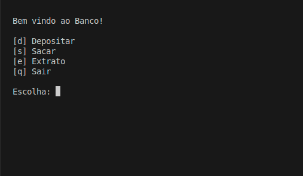

# V1-BANK Python DIO's Lab Project
This is a Bank interactive menu solution for the Python Suzerano bootcamp from DIO, made in python, where includes the usage of basic python syntax and shows a variety of methods to manipulate strings.   

## Functionalities
- Interactive terminal menu
- Deposit functionality
- Withdrawal with daily limits
- Transaction history (statement)
- Basic validation (withdrawal limits, insufficient balance)

## Skills
- Python

## Technologies
- Programming logic
- String manipulation
- Use of functions and global variables
- User interaction via terminal
- Screen clearing using "os" lib
- Usage of alternative string manipulation 
